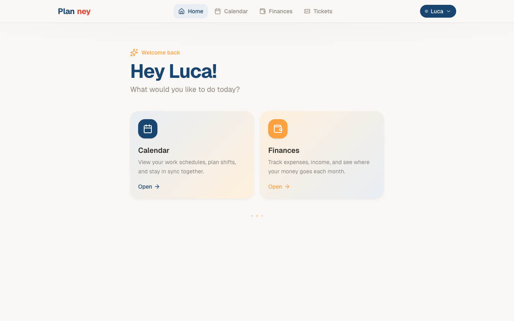

# Planney

A shared planning app for couples. Manage work schedules on a shared calendar, organize tasks on a board, and track finances with spending insights and monthly projections.



## Features

**Calendar**
- Shared work schedule for two people
- Plan shifts and log work hours with time tracking
- Day, week, and month views

**Task board**
- Create tickets with priority levels and status tracking (open, in progress, done)
- Assign tasks between team members
- Categorize and filter by status

**Finance tracker**
- Log income and expenses by category
- Monthly spending breakdown with pie charts
- Income vs. expense bar charts for trend comparison
- Financial projections based on recurring entries and historical averages

**Design**
- Personalized color schemes per user
- Mobile-first responsive layout with bottom navigation
- Real-time sync via Supabase

## Tech stack

- **Next.js 16** / React 19 / TypeScript
- **Tailwind CSS 4** + shadcn/ui
- **Supabase** (PostgreSQL) for backend and real-time sync
- **Recharts** for data visualization
- **date-fns** for date handling

## Run locally

```bash
git clone https://github.com/L-ubu/Planney.git
cd Planney
npm install
npm run dev
```

Requires a Supabase project. Set `NEXT_PUBLIC_SUPABASE_URL` and `NEXT_PUBLIC_SUPABASE_ANON_KEY` in `.env.local`.

## License

MIT
